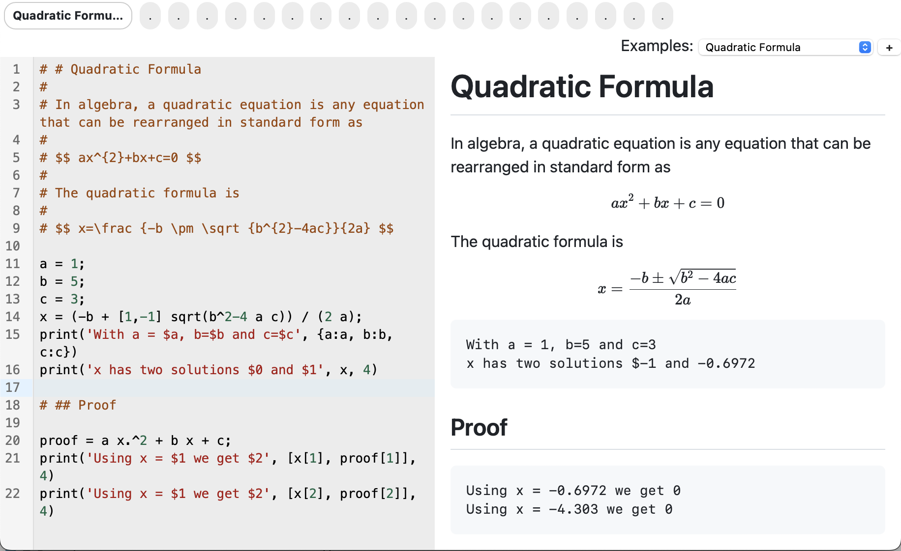
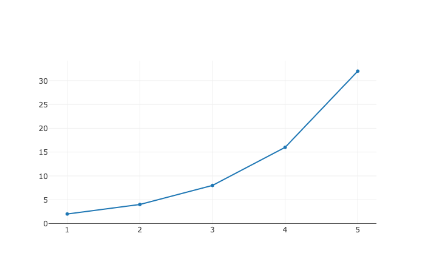
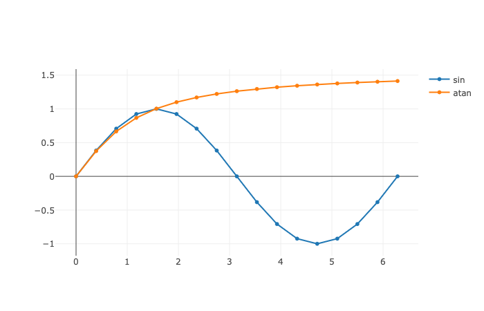
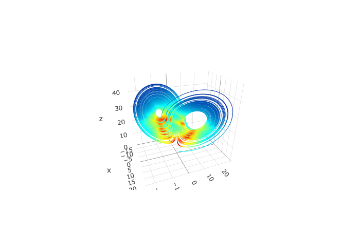

# Engineering-Solver

Is a tool for doing numerical calculations fast and easy. It includes units, thermodynamic properties and many more.

[](https://dvd101x.github.io/Engineering-Solver/)

## Quick start

Open this site [Engineering-Solver](https://dvd101x.github.io/Engineering-Solver/).

Write a few statements like:

``` jl
2+2
3 m to mm
3 m + 2 in to mm
force = 10 N
mass = 10 lb
acceleration = force / mass
acceleration to yard/s^2
```

You will notice you get instant results as you are typing your expressions.

# Install and develop locally

Clone this repository and run the following command to install dependencies.
```
npm install
```
To test
```
npm run dev
````
To build 
````
npm run build
````

## Interface

There are two main areas, the input on the left and output on the right. A top navigation bar with 20 tabs and an example selector.

In the example selector you can find:

* Numbers
* Matrices
* Objects
* Variables
* Units
* Thermodynamic properties
* Psychrometric properties

You can work on any of the 20 tabs and your progress will be saved automatically after a few seconds of inactivity.

## [MathJS](https://mathjs.org/)

Does all the calculations and unit conversions. Here are some useful topics from the [docs](https://mathjs.org/docs/index.html).
* [Expressions](https://mathjs.org/docs/expressions/index.html)
  * [Syntax](https://mathjs.org/docs/expressions/syntax.html)
  * [Algebra](https://mathjs.org/docs/expressions/algebra.html)
* [Data Types](https://mathjs.org/docs/datatypes/index.html)
  * [Numbers](https://mathjs.org/docs/datatypes/numbers.html)
  * [BigNumbers](https://mathjs.org/docs/datatypes/bignumbers.html)
  * [Fractions](https://mathjs.org/docs/datatypes/fractions.html)
  * [Complex Numbers](https://mathjs.org/docs/datatypes/complex_numbers.html)
  * [Matrices](https://mathjs.org/docs/datatypes/matrices.html)
  * [Units](https://mathjs.org/docs/datatypes/units.html)
* [Reference](https://mathjs.org/docs/reference/index.html)
  * [Classes](https://mathjs.org/docs/reference/classes.html)
  * [Functions](https://mathjs.org/docs/reference/functions.html)
  * [Constants](https://mathjs.org/docs/reference/constants.html)

## Chemistry molar mass: MM()

To call this function use `MM('H2O')` and this will get an object with the data of the compound, including totalMass, number of atoms of each element, mass fraction for each element, etc. The formula can include a notation with parenthesis and dot notation for hydrates.

In:
``` jl
borax = MM('Na2(B4O5(OH)4).8H2O');
borax.elements
borax.totalMass
borax.fraction
borax.fraction.Na
```
Out:
``` javascript
{"Na": 2, "B": 4, "O": 17, "H": 20}
381.37214 g / mol
{"Na": 0.12056344755545, "B": 0.11339055862864, "O": 0.71318738699686, "H": 0.052858606819051}
0.12056344755545
```

## [CoolProp](http://www.coolprop.org/coolprop/HighLevelAPI.html#propssi-function)

Used for calling PropsSI and HAPropsSI but the unit handling is done with MathJS, thus the functions are not exactly the same as in CoolProp.

### Fluid Properties: props()

In: 
``` jl
# Saturated vapor enthalpy [J/kg] of R134a at 25C
props('H', 'R134a', {T:25 celsius, Q:1})
```
Out: ` 4.1233395323186804e+5 J / kg`

#### References

* [Sample Props Code](http://coolprop.sourceforge.net/coolprop/examples.html#sample-props-code)
* [List of Parameters (Properties)](http://www.coolprop.org/coolprop/HighLevelAPI.html#table-of-string-inputs-to-propssi-function)
* [List of Fluids](http://coolprop.sourceforge.net/fluid_properties/PurePseudoPure.html#list-of-fluids)

### [Fluid Phase: phase()](http://coolprop.sourceforge.net/coolprop/HighLevelAPI.html#phasesi-function)

It can be useful to know what the phase of a given state point is.

In:
``` jl
# Phase of Water at 1 atmosphere and 0% Quality
phase('Water', {P:1 atm, Q:0 %})
```
Out: `twophase`

### [Humid Air Properties: HAprops()](http://coolprop.sourceforge.net/fluid_properties/HumidAir.html)

In:

``` jl
#Enthalpy (J per kg dry air) as a function of temperature, pressure,
#    and relative humidity at dry bulb temperature T of 25C, pressure
#    P of one atmosphere, relative humidity R of 50%
HAprops('H', {T:25 degC, P:1 atm, R:50%})
```
Out: `50423.45039102888 J / kg`

* [Humid Air: Sample Code](http://coolprop.sourceforge.net/fluid_properties/HumidAir.html#sample-hapropssi-code)
* [Humid Air: List of Parameters (Properties)](http://coolprop.sourceforge.net/fluid_properties/HumidAir.html#table-of-inputs-outputs-to-hapropssi)

## [CodeMirror](https://codemirror.net)

CodeMirror is used for editing the mathjs code in the browser and includes:
- Syntax Highlighting
- Autocompletion
  - Functions
  - Physical Constants
  - Prefixed Units
  - Variables in Scope
- Drag and Drop text documents
- Other key bindings
  - Find and replace <kbd>Ctrl</kbd> + <kbd>F</kbd>
  - The rest can be found in [CodeMirror: Reference Manual](https://codemirror.net/docs/ref/)

## [Plotly](https://plotly.com/javascript/)

Is used to do plots. Uses the main interface of plotly without many changes, but running first through mathjs simplifications.

### Plot hello world [example](https://plotly.com/javascript/getting-started/)
```jl
plot([{x:1:5, y:2.^(1:5)}])
```


### Plot functions

```jl
x = 0: pi/8: 2 pi;

plot([
  {x:x, y:sin(x), name:"sin"},
  {x:x, y:atan(x), name:"atan"}
])
```


### Plot advanced functions

```jl
sigma = 10;
beta = 2.7;
rho = 28;

lorenz(t, u) = 
  [ 
    sigma * (u[2] - u[1]),
    u[1] * (rho - u[3]) - u[2],
    u[1] * u[2] - beta * u[3]
  ];

sol = solveODE(lorenz, [0, 100], [1, 1, 1]);

plot(
 [{
    x: flatten(sol.y[:,1]),
    y: flatten(sol.y[:,2]),
    z: flatten(sol.y[:,3]),
    type: "scatter3d",
    mode: "lines"
}])
```


# Warnings

- All calculations are done locally
- There is no server saving your calculations
- Don't run code that you don't trust 