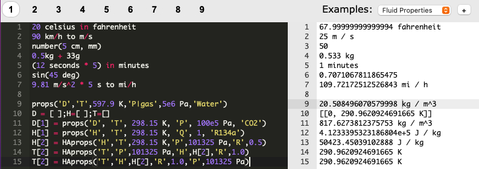

# Engineering-Solver

Is a tool for doing numerical calculations fast. It includes units, thermodynamic properties and many more.

[](https://dvd101x.github.io/Engineering-Solver/)

## Quick start

Open this site [Engineering-Solver](https://dvd101x.github.io/Engineering-Solver/)

Write a few statements like:

``` python
2+2
3 m to mm
3 m + 2 in to mm
force = 10 N
mass = 10 lb
acceleration = force / mass
acceleration to yard/s^2
```

You will notice you get instant results as you are typing your expressions.

## Interface

There are two main areas, the input on the left and output on the right. A top navigation bar with 9 tabs and an example selector.

In the example selector you can find:

* Numbers
* Matrices
* Objects
* Variables
* Units
* Thermodynamic properties
* Psychrometric properties

You can work on any of the 9 tabs and your progress will be saved automatically on a successful execution of your commands or a new line.

## [MathJS](https://mathjs.org/)

Does all the calculations and unit conversions.

* [Syntax](https://mathjs.org/docs/expressions/syntax.html)
* [Matrices](https://mathjs.org/docs/datatypes/matrices.html)
* [Units](https://mathjs.org/docs/datatypes/units.html)
* [Functions](https://mathjs.org/docs/reference/functions.html)

## [CoolProp](http://www.coolprop.org/coolprop/HighLevelAPI.html#propssi-function)

Used for calling PropsSI and HAPropsSI but the unit handling is done with MathJS, thus the functions are not exactly the same as in CoolProp

### Fluid Properties: props()

In: 
``` python
# Saturated vapor enthalpy [J/kg] of R134a at 25C
props('H', 'T', 25 celsius, 'Q', 1, 'R134a')
```
Out: ` 4.1233395323186804e+5 J / kg`

#### References

* [Sample Props Code](http://coolprop.sourceforge.net/coolprop/examples.html#sample-props-code)
* [List of Parameters (Properties)](http://www.coolprop.org/coolprop/HighLevelAPI.html#table-of-string-inputs-to-propssi-function)
* [List of Fluids](http://coolprop.sourceforge.net/fluid_properties/PurePseudoPure.html#list-of-fluids)

### [Fluid Phase: phase()](http://coolprop.sourceforge.net/coolprop/HighLevelAPI.html#phasesi-function)

It can be useful to know what the phase of a given state point is.

In:
``` python
# Phase of Water at 1 atmosphere and 0% Quality
phase('P',1 atm,'Q',0 %,'Water')
```
Out: `twophase`

### [Humid Air Properties: HAprops()](http://coolprop.sourceforge.net/fluid_properties/HumidAir.html)

In:

``` python
#Enthalpy (J per kg dry air) as a function of temperature, pressure,
#    and relative humidity at dry bulb temperature T of 25C, pressure
#    P of one atmosphere, relative humidity R of 50%
HAprops('H','T',25 degC,'P',1 atm,'R',50%)
```
Out: `50423.45039102888 J / kg`

* [Humid Air: Sample Code](http://coolprop.sourceforge.net/fluid_properties/HumidAir.html#sample-hapropssi-code)
* [Humid Air: List of Parameters (Properties)](http://coolprop.sourceforge.net/fluid_properties/HumidAir.html#table-of-inputs-outputs-to-hapropssi)

## [Ace](https://ace.c9.io/)

Ace is used for it's editing capabilities in the browser. You can access the quick menu by pressing `F1`
