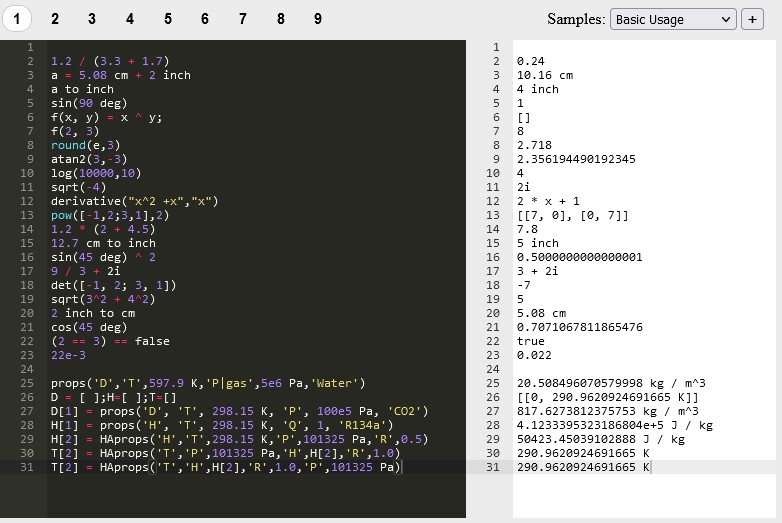

# Engineering-Solver
Engineering Solver helps to do calculations with units and thermodynamic properties in a very fast way.

# This is

A tool for doing numerical calculations fast. It includes units, thermodynamic properties and many more.

[](https://replit.com/@dvd101x/Engineering-Solver)

## Quick start

Open this repl [Engineering-Solver](https://replit.com/@dvd101x/Engineering-Solver)

Write a few statements like:
```
2+2
3 m to mm
3 m + 2 in to mm
```

Then add a few samples from the right menu

You will notice you get instant results as you are typing your expressions.

## [MathJS](https://mathjs.org/)
Mathjs is the core of the project, as it doeas all the calculations and conversions.

## [CoolProp](http://www.coolprop.org/coolprop/HighLevelAPI.html#)

Used for calling PropsSI and HAPropsSI but the unit handling is done with MathJS.

## [Ace](https://ace.c9.io/)

Ace is used for it's editing capabilities in the browser.

# Features

Work with calculations, variables, arrays, objects and others on a quick an instant interface.

# To-do

* [ ] Input Syntax highliting
  * [ ] [Ace](https://ace.c9.io/#nav=higlighter)
  * [ ] [MathJS](https://mathjs.org/docs/expressions/syntax.html)
* [ ] Resluts with better styling Maybe H1 Main results, H1 All results (order by name)
* [ ] Rename variables
* [ ] Ask about help(props)
* [ ] Samples 
  * [ ] Commented samples
  * [ ] More samples
  * [ ] Split samples in selection groups
* [ ] Notebook interface (like jupyter lite, mathnotepad or wolfram)
* [ ] Some help files
* [ ] Implement for cycles
* [ ] Tabs (rename, reorder, open and close) like caret editor

# Maybe
* [ ] Emulate mathjs command line functions
* [ ] js folders
* [ ] Better styling with grid

# Done

* [x] Aditional functions in CoolProp high level (maybe using REGEX)
  * [x] derivative
  * [x] second derivative
  * [x] phase
* [x] Refactor
* [x] Fix reaload when importing samples
* [x] Use map for repated functions
* [x] Change to use the value properties when the data is needed, not a prior.
* [x] To specify the phase to be used, add the “|” delimiter to one (and only one) of the input key strings followed by one of the phase strings in the table below
* [x] If prop has | get everything to the left of |
* [x] If prop is a partial derivative d(H)/d(T)|P implement the units for the H/T
* [x] Implement parser.evaluate with arrays instead of \n (new lines when next version of mathjs is done)
* [x] Change output to a lighter theme
* [x] External css and main js
* [x] Tabs with radio buttons
* [x] Use ace editor
* [x] Impleent CoolProp with units
* [x] Save states on newlines or successul evaluate
* [x] Webworker
* [x] localStorage
